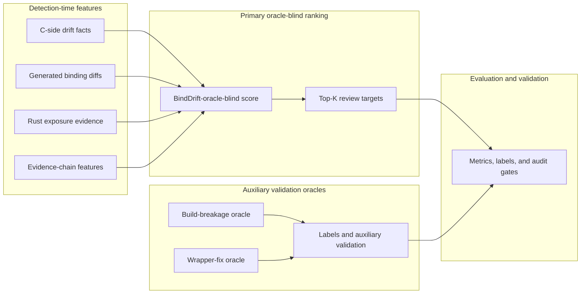

# BindDrift: Prioritizing Review Targets for Rust-for-Linux Cross-Language API and Contract Drift

## Abstract

Rust-for-Linux safe abstractions rely on Linux C APIs whose signatures, layouts,
and behavioral contracts evolve outside Rust's type system. BindDrift
prioritizes review targets for Rust-for-Linux cross-language API and contract
drift. It is a static-analysis and cross-version replay artifact for
evidence-backed warning prioritization, not automatic bug confirmation:
BindDrift does not prove Rust safe abstraction soundness and does not
automatically detect bugs. BindDrift separates low-level cross-version drift
facts from promoted Rust-impact warnings, then attaches an evidence chain from
Linux C declarations or helpers through generated Rust bindings, unsafe Rust
call sites, wrapper code, safety comments, or public safe abstractions. Each
emitted warning is a review target for maintainers. The current canonical
replay spans 21 Linux snapshots from `v6.1` through `v7.0` plus `HEAD`, covers
20 adjacent version pairs, records 16,757 drift facts, and promotes 320
Rust-impact warnings. An 800-item pooled review set is double-reviewed and
adjudicated. The strict `BindDrift-oracle-blind` ranking gate reports
P@10 = 1.00, P@20 = 1.00, P@50 = 0.86, P@100 = 0.43, and NDCG@20 = 1.00,
improving P@20 by 0.60, P@50 by 0.64, and NDCG@20 by 0.5394 over the
strongest simple baseline in the shared pooled-label evaluation. The final
pooled labels contain 50 adjudicated true-positive review targets, including
29 `TRUE_SEMANTIC_DRIFT` rows and 20 `TRUE_WRAPPER_FIX` rows.

## 1. Introduction

Rust-for-Linux reduces direct exposure to kernel C APIs by routing most driver
code through Rust abstractions. This architecture improves local safety, but it
also creates a cross-language maintenance problem: a safe Rust API can remain
unchanged while the underlying C API changes its failure convention, refcount
contract, allocation/free pairing, or sleepability constraints.

BindDrift prioritizes review targets for Rust-for-Linux cross-language API and
contract drift. It frames this as a software evolution problem. The relevant
dependency chain is an evidence chain:

```text
Linux C function/type/macro/helper
-> bindgen-generated Rust binding or Rust helper
-> unsafe Rust call site
-> public safe abstraction
```

The key observation is that Rust type checking sees only part of this chain.
Type-visible signature or layout changes can break builds, but semantic changes
such as `NULL` versus `ERR_PTR`, owned versus borrowed references, or new
blocking behavior may still require human review.

This paper therefore makes a warning prioritization claim: BindDrift identifies
cross-version drift facts, filters them through Rust-impact evidence, and ranks
the resulting warnings as review targets. It does not certify Rust abstraction
correctness or automatically confirm a concrete runtime defect.

## 2. Background And Scope

Rust-for-Linux separates generated bindings from hand-written abstractions.
Bindings expose selected C declarations to Rust. Helpers expose C inline
functions and complex macros that bindgen cannot directly represent. Safe
abstractions then encapsulate unsafe calls and document the invariants callers
must rely on.

BindDrift targets Linux mainline, x86_64, Rust-enabled builds when the local
toolchain can produce them, and the `rust/bindings`, `rust/helpers`, and
`rust/kernel` surfaces. It does not prove Rust safe abstraction soundness. Tier
2 semantic findings are review targets and are explicitly marked as
indicator-based. They are not confirmed defects.

## 3. Design

BindDrift has five stages.

First, it captures environment metadata: kernel commit, config hash, tool
versions, and kernel Rust availability. For historical replay, BindDrift parses
each selected kernel release's minimum-tool script and writes a toolchain matrix
containing the Rust compiler, rust-src path, rustfmt, clippy-driver, and bindgen
binary used for that release. The matrix also records `LIBCLANG_PATH`,
`LLVM_CONFIG_PATH`, libclang probe output, and blocking compatibility issues.
This avoids a known validity threat: newer Rust compilers or mismatched
libclang versions can break older kernel Rust build rules even when the
kernel's own minimum supported Rust version is lower.

Second, extractors collect C facts, Rust facts, and generated binding facts when
available. C extraction defaults to the Rust-facing C surface: direct includes
from the kernel binding helper plus Rust helper sources. It records functions,
structs, macros, and behavior indicators such as `NULL_RETURN`,
`ERR_PTR_RETURN`, `ERROR_CODE`, `REFCOUNT_GET`, `REFCOUNT_PUT`, `ALLOC`,
`FREE`, and `MAY_SLEEP`. Rust extraction records binding uses, unsafe scopes,
public APIs, safety comments, Drop/Clone/lifetime patterns, and Option/Result
or error mappings.

Third, BindDrift builds a C-to-Rust dependency graph. Nodes include C functions,
C structs, macros, behavior indicators, Rust bindings, unsafe call sites, safe
APIs, safety comments, error mappings, and lifetime facts. Edges capture
generation, binding calls, safe API exposure, contract comments, error mapping,
and lifetime relevance.

Fourth, detectors produce two layers of output. Drift facts record low-level
cross-version changes in signatures, fields, layouts, macro/constants, helpers,
and behavior indicators. Promoted warnings are the subset with Rust-impact
evidence, such as direct binding use, safe API exposure, safety comments,
or error/lifetime mappings. Build-breakage and wrapper-fix evidence is not
used to promote warnings in the paper's primary ranking; it is retained for
labels and auxiliary validation.

Fifth, the primary ranker, `BindDrift-oracle-blind`, scores warnings with
detection-time features: C-side drift strength, Rust exposure, unsafe proximity,
safe API relevance, contract evidence, fanout penalties, repeated occurrence,
and evidence-chain richness. This is separate from the current scorer used for
auxiliary diagnosis, which may contain build/wrapper oracle components and is
therefore not reported as the paper's primary ranking result.

Figure 1 gives the oracle-blind data flow used for the paper claim. The
build-breakage oracle is used only for labels and auxiliary validation. The
wrapper-fix oracle is auxiliary validation, while symbol-level wrapper matching
is treated as an upper bound. Neither oracle has a data path into the
`BindDrift-oracle-blind` primary score.



## 4. Implementation

The artifact is a Python command-line tool backed by SQLite and JSONL reports.
It treats `vendor/linux` as an input repository and uses managed worktrees under
`.binddrift` for historical replay. The CLI supports toolchain checks, version
selection, kernel object-tree preparation, binding extraction, Rust extraction,
C extraction, graph construction, detection, ranking, evaluation, and paper
artifact generation.

The schema stores version metadata, commits, binding facts, Rust facts, C facts,
graph nodes and edges, extraction diagnostics, drift events, build-breakage
events, wrapper-fix candidates, review labels, and generated table provenance.

## 5. Evaluation

The CCF-B-strength evaluation is organized around five research questions:

- RQ1: Can BindDrift extract reliable cross-language drift facts?
- RQ2: Does evidence gating reduce review volume while preserving useful
  review targets?
- RQ3: Does `BindDrift-oracle-blind` improve top-K review yield over strong
  baselines?
- RQ4: What semantic drift patterns appear in adjudicated cases?
- RQ5: How reproducible is the artifact across versioned toolchains?

The main experiment replays 20 adjacent Linux mainline pairs across 21 version
snapshots from `v6.1` through `v7.0` plus the checked-out `HEAD` on x86_64. Each
included version is configured with a Rust-enabled kernel config, built with
versioned Rust and bindgen tools from the matrix, and required to produce
generated binding snapshots before drift detection. The canonical `latest`
manifest fixes the files used by all paper tables: 16,757 drift facts, 320
promoted Rust-impact warnings, the 800-row pooled review set, the 304 reviewed
semantic targets, and the generated case-study suite. `paper/tables/table_index.json`
records sha256 provenance for every generated main table.

### RQ1: Can BindDrift extract reliable cross-language drift facts?

Problem. BindDrift's ranking claim depends on whether the C, generated binding,
and Rust evidence facts are reliable enough to support downstream review
targets.

Method. We run a strict extractor audit over C functions, C behavior
indicators, Rust binding uses, Rust safe API exposures, Rust error mappings,
Rust lifetime facts, and promoted warning evidence chains. The audit uses only
rows with explicit reviewer/adjudication provenance and records parser
limitations through negative controls.

Data. The strict extractor audit samples 830 facts across the canonical replay,
including 150 promoted warning evidence chains.

Result. The audit reports Cohen's kappa = 1.0 and `all_minimums_pass = true`,
including promoted warning evidence precision above the 0.85 gate.

Interpretation. These results support using extracted cross-language evidence
for warning prioritization and paper tables, but not completeness claims.

Threat. Regex parser incompleteness and missing generated binding outputs remain
threats. The generated failure taxonomy reports limitation-focused negative
controls for every extractor; these controls document parser boundaries and
should not be read as completeness or bug confirmation evidence.

### RQ2: Does evidence gating reduce review volume while preserving useful review targets?

Problem. The raw drift stream is too large for maintainers to review directly,
so the paper needs to show a concrete workload reduction path.

Method. We report the pipeline volume from drift facts to promoted Rust-impact
warnings and then to fixed top-K review budgets produced by the primary
oracle-blind ranker.

Data. The canonical `latest` manifest records 16,757 drift facts and 320
promoted Rust-impact warnings.

Result. Evidence gating reduces 16,757 drift facts to 320 promoted warnings, a
98.09% reduction. Fixed review budgets reduce the workload further: top-10 is
0.06% of drift facts and 3.12% of promoted warnings, top-20 is 0.12% of drift
facts and 6.25% of promoted warnings, top-50 is 0.30% of drift facts and 15.62%
of promoted warnings, and top-100 is 0.60% of drift facts and 31.25% of
promoted warnings.

Interpretation. RQ2 supports the stronger framing that BindDrift prioritizes
review targets rather than trying to make every warning actionable.

Threat. Workload reduction alone is not precision. RQ3 and RQ4 provide the
pooled-label and semantic-label checks needed to interpret this reduction.

### RQ3: Does `BindDrift-oracle-blind` improve top-K review yield over strong baselines?

Problem. A useful prioritizer must beat simple rankers without leaking build or
wrapper oracles into the primary score.

Method. Baselines compare `BindDrift-oracle-blind` against binding-diff,
C-signature, C-indicator, Rust-use, graph-reachability, no-ranking, and random
variants on the same pooled label set. Ablations remove graph evidence,
Rust-impact gating, and contract evidence. RQ3 follows the same data-flow split as
Figure 1: detection-time features feed `BindDrift-oracle-blind`, auxiliary
validation oracles feed labels and validation checks, and the evaluation and
validation node consumes both the Top-K output and auxiliary labels after
ranking. Neither oracle has a data path into Top-K selection or the primary
score.

Data. A trusted binddrift-review expert protocol uses a blind pooled review set
and the binddrift-review role artifacts: evidence collector, reviewer 1,
reviewer 2, adjudicator, and CSV merge report. Here, blind means reviewer roles
do not receive ranker names, ranks, scores, adjudicated labels, or the other
reviewer's notes before submitting labels. The reviewer roles are not blind to
oracle evidence used for labels: build-breakage and wrapper-fix evidence may
appear in evidence packets because they define `TRUE_BUILD_BREAKAGE` and
`TRUE_WRAPPER_FIX`. Those oracles remain auxiliary validation only and are
forbidden from the `BindDrift-oracle-blind` primary score. The two reviewer
role artifacts label warnings independently, then the adjudicator role receives
the evidence packet plus both completed reviewer outputs and records the final
label. `UNCLEAR` is allowed for insufficient evidence and is not counted as a
true positive; `TRUE_WRAPPER_FIX` requires later same-symbol or same-contract
Rust wrapper/helper/binding evidence and is reported separately from
`TRUE_SEMANTIC_DRIFT`, which requires C drift, Rust exposure, and plausible
stale-contract dependence. This adjudicated binddrift-review label set is the
only source of semantic precision claims.

The review artifacts are accepted as a trusted expert double review because the
protocol records role separation, rank/score blindness, reviewer independence,
adjudication coverage, and label-leakage checks. The review artifacts do not
participate in primary scoring and reviewer roles do not receive adjudicated
ground-truth labels. All 800 pooled warnings are double-labeled and
adjudicated, with Cohen's kappa = 0.8161 and agreement rate 0.9062. The final
pooled labels are 1 `TRUE_BUILD_BREAKAGE`, 20
`TRUE_WRAPPER_FIX`, 29 `TRUE_SEMANTIC_DRIFT`, 219 `BENIGN_DRIFT`, 530
`FALSE_POSITIVE`, and 1 `UNCLEAR`.

Result. The strict pooled ranking table reports `BindDrift-oracle-blind`
P@10 = 1.00, P@20 = 1.00, P@50 = 0.86, P@100 = 0.43, NDCG@20 = 1.00, and
AUPRC = 0.9013. The strongest simple baseline is `rust_use`, with P@20 = 0.40,
P@50 = 0.22, NDCG@20 = 0.4606, and AUPRC = 0.3477. The strict ranking gate passes:
`BindDrift-oracle-blind` improves top-K review yield over the strongest simple
baseline by 0.60 P@20, 0.64 P@50, 0.5394 NDCG@20, and 0.5536 AUPRC in the shared pooled-label
evaluation.

False-positive risk is therefore reported as a taxonomy rather than as the
paper's main metric for the top-K review prioritization claim. In the 800-row
pooled review set, 530 rows are `FALSE_POSITIVE` and 219 are `BENIGN_DRIFT`; the
M4 taxonomy uses these non-true review outcomes to explain why ranking matters.
The categories are binding-only/generated surface evidence (309), weak
Rust reachability (20 rows), layout ambiguity (94), macro/constant
over-prioritization (107), and real C drift without Rust contract impact (219).
The generated taxonomy
table includes examples for every observed category.

Interpretation. These labels support a claim that BindDrift surfaces useful
review targets, not a claim that every warning is a confirmed defect. The
build-breakage oracle and wrapper-fix oracle are auxiliary validation only; they
support labels and validation checks, not the primary score.

Threat. Oracle limitations and label ambiguity remain threats. The paper tables
are generated from artifact outputs, not hand-entered numbers, and the
oracle-blind gate rejects forbidden primary score components.

### RQ4: What semantic drift patterns appear in adjudicated cases?

Problem. The semantic tier is the most subjective part of the artifact, so the
paper must separate semantic review targets from wrapper-fix validation and from
false positives.

Method. The targeted semantic review pass uses label-blind semantic detector
quotas, then joins binddrift-review adjudicated double-review labels after
target selection. `TRUE_WRAPPER_FIX` is reported separately and is not counted
as `TRUE_SEMANTIC_DRIFT`.

Data. The pass samples 400 semantic target candidates and reviews 304
adjudicated rows across nullability, ownership/refcount, allocation/free,
sleepability/context, and layout/field categories.

Result. It finds 29 `TRUE_SEMANTIC_DRIFT` rows, 17 `TRUE_WRAPPER_FIX` rows, 1
build-breakage row, 2 benign rows, and 255 false-positive rows, with no unclear
rows. The semantic gate passes with 29 non-wrapper semantic true positives and
4 semantic drift types. The artifact also includes 8 positive warning-backed
case studies and 2 negative/failure-analysis cases selected from adjudicated
labels, covering 4 semantic true cases, 4 non-wrapper semantic cases, and 4
wrapper-fix-backed cases.

Interpretation. Semantic review targets may be reported as a secondary
contribution while preserving the claim boundary that they remain review
targets rather than confirmed runtime bugs.

Threat. Semantic labels have unavoidable subjectivity. The review guide
separates `TRUE_SEMANTIC_DRIFT`, `TRUE_WRAPPER_FIX`, `BENIGN_DRIFT`,
`FALSE_POSITIVE`, and `UNCLEAR`, and the evaluation uses the adjudicated label
for paper metrics.

### RQ5: How reproducible is the artifact across versioned toolchains?

Problem. Replay claims are fragile unless the artifact records the exact
versions, toolchain choices, generated outputs, and table provenance.

Method. The artifact records a run manifest, evaluation protocol, toolchain
matrix, strict gates, and sha256 provenance for generated paper tables. The
one-command reproduction path is `uv run python -m binddrift.artifact
reproduce`, with `uv run binddrift paper build --stage final` as the final paper
gate.

Data. The main replay uses the canonical x86_64 `latest` manifest. The arm64
external-validity slice replays 8 release tags from `v6.13` through `v7.0`,
covering 7 adjacent pairs with Rust-enabled arm64 binding generation.

Result. All 7 arm64 pairs complete, so there are 0 failed pairs; failed pairs
would be reported with pair status, build status, and error text rather than
silently skipped. The slice records 7,086 drift facts and 248 promoted
Rust-impact warnings. Warning overlap with the x86_64 replay is high: 236
warning type/symbol keys are shared, 4 are arm64-only, and 47 are x86_64-only.
The architecture delta is concentrated in `SignatureDrift`, where arm64 reports
209 warnings versus 269 on x86_64; `MacroConstDrift` is unchanged at 26 on both
architectures, and `FieldDrift` drops from 25 on x86_64 to 13 on arm64.

Interpretation. RQ5 supports reproducibility for the paper tables and external
validity for the replay and prioritization pipeline, while the main
pooled-label claims remain anchored to the canonical x86_64 review set.

Threat. The arm64 slice reduces external validity threats but does not remove
them entirely: arm64 is still Linux mainline, uses the same Rust-for-Linux
surfaces, and does not add independent review labels. Future work should
evaluate rust-next branches, additional architectures, and complete release-tag
histories once full binding generation is available.

## 6. Case Studies

The main paper uses three representative case studies. Each case follows the
same evidence chain: old C contract, new C contract, generated binding or
helper exposure, Rust safe or unsafe dependency, binddrift-review adjudication,
and maintainer review implication.

### Case 1: Nullability/Error Drift (`errname`)

`errname` is a wrapper-fix-backed nullability/error case. The C-side evidence
records the return-convention drift, the Rust evidence reaches `Error::name`,
and adjudication labels the warning `TRUE_WRAPPER_FIX`. The case illustrates
that BindDrift treats later wrapper/helper changes as auxiliary validation for a
review target, not as standalone proof of semantic drift.

### Case 2: Sleepability/Context Drift (`init_wait`)

`init_wait` is an adjudicated `TRUE_SEMANTIC_DRIFT` case. The C macro/helper
contract changes across the replay pair, and the Rust evidence reaches
`CondVar::new` through an unsafe initialization path. The case shows why
contract drift can matter even when the compiler accepts the current binding
shape.

### Case 3: Allocation/Free / Lifetime Drift (`dma_free_attrs`)

`dma_free_attrs` is an allocation/free semantic case. The C signature and free
contract evidence reaches the Rust DMA drop path through an unsafe binding use,
and adjudication labels the warning `TRUE_SEMANTIC_DRIFT`. The review question
is whether the ownership abstraction remains synchronized with the changed C
free-side contract.

Artifact appendix. The artifact includes 8 positive warning-backed case studies
generated only from adjudicated true positives:

- `security_secid_to_secctx`: nullability/error semantic drift reaches
  `SecurityCtx::from_secid`.
- `init_wait`: sleepability/context semantic drift reaches `CondVar::new`.
- `errname`: wrapper-fix-backed nullability/error drift reaches `Error::name`.
- `__mutex_init`: wrapper-fix-backed sleepability/context drift reaches Rust
  synchronization helper code.
- `errname`: an earlier wrapper-fix-backed nullability/error drift reaches
  `Error::name`.
- `dma_free_attrs`: allocation/free semantic drift reaches the Rust DMA drop
  path.
- `security_release_secctx`: allocation/free semantic drift reaches the Rust
  security context drop path.
- `__mutex_init`: another wrapper-fix-backed sleepability/context drift reaches
  Rust synchronization helper code.

The appendix suite also includes 2 negative/failure-analysis cases:

- `refcount_set`: ownership/refcount evidence is rejected because broad-family
  wrapper evidence is auxiliary only.
- `kunit_case`: layout/field evidence is rejected because the case lacks a
  direct same-contract Rust-impact chain.

Each case is classified as a review target rather than a defect claim. No
positive case study is unlabeled, false positive, benign drift, or
single-version-only. The full case suite covers five drift target categories,
contains 4 semantic true cases, 4 non-wrapper semantic cases, 4 wrapper-fix-backed
cases, and has no local absolute paths in the generated case artifacts.

## 7. Threats To Validity

Internal validity threats include regex parser incompleteness, missing generated
binding outputs, toolchain/config differences, and oracle limitations. BindDrift
mitigates these by recording extraction diagnostics, environment metadata,
config hashes, and explicit separation between `BindDrift-oracle-blind`
ranking and auxiliary build/wrapper evidence.

Construct validity threats include the ambiguity of semantic drift labels and
the fact that warnings are review targets rather than confirmed defects. The
review guide separates `TRUE_SEMANTIC_DRIFT`, `TRUE_WRAPPER_FIX`,
`BENIGN_DRIFT`, `FALSE_POSITIVE`, and `UNCLEAR`, and the evaluation uses the
adjudicated label for paper metrics. Not every warning is a confirmed bug.
Wrapper-fix-backed labels and semantic labels are reported separately, and
`TRUE_WRAPPER_FIX` is not counted as `TRUE_SEMANTIC_DRIFT`. Semantic labels have
unavoidable subjectivity even with double review and adjudication, so the paper
reports semantic labels as stale-contract review targets rather than confirmed
bugs.
The review artifacts are treated as a trusted binddrift-review expert protocol
because the gate records role separation, rank/score blindness, adjudication
coverage, agreement rate, Cohen's kappa, label-leakage checks, and
reviewer-disagreement examples.
The overall warning-set precision is low, and BindDrift does not optimize for
exhaustive defect confirmation across every promoted warning. The method targets
prioritization: top-K ranking metrics, baseline lift, and the false-positive
taxonomy are the primary evidence for maintainer review workload reduction.

External validity threats include focusing on Linux/Rust-for-Linux and using
x86_64 as the main labeled evaluation architecture. The arm64 external-validity
slice reduces this threat by showing that the replay and warning-prioritization
pipeline runs across 8 arm64 release tags with 7 completed pairs, explicit
failed-pair reporting, and warning overlap/type-delta analysis. It does not
remove the threat entirely: arm64 is still Linux mainline, uses the same
Rust-for-Linux surfaces, and does not add independent review labels. Future
work should evaluate rust-next branches, additional architectures, and complete
release-tag histories once full binding generation is available.

## 8. Related Work

BindDrift is related to API evolution, cross-language binding generation,
software maintenance mining, static defect detection for systems software, and
Rust-for-Linux empirical studies. Its distinguishing focus is the
cross-language path from evolving C APIs through generated bindings and unsafe
Rust wrappers into safe abstraction contracts.

## 9. Conclusion

BindDrift prioritizes review targets for Rust-for-Linux cross-language API and
contract drift. It makes cross-language dependencies explicit, separates drift
facts from promoted warnings and adjudicated labels, and ranks API/contract
drift warnings for maintainer review. The current artifact implements the full
pipeline and reports measured pilot results while preserving the central claim
boundary: BindDrift prioritizes evidence-backed review targets; it does not
certify correctness, claim complete drift coverage, or claim every warning is a
confirmed defect.
