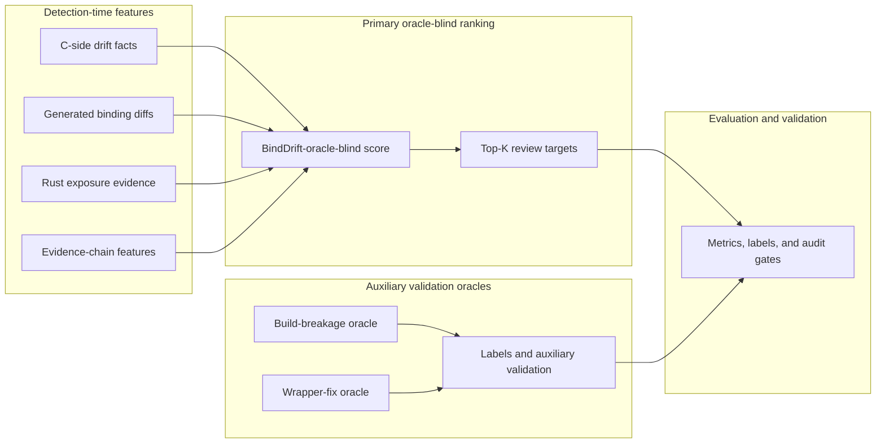

# Figure: Oracle-Blind Ranking Data Flow

The primary ranker is `BindDrift-oracle-blind`. Its score uses only
detection-time features. The build-breakage and wrapper-fix oracles feed labels
and auxiliary validation; they do not feed the primary score or Top-K selection.
